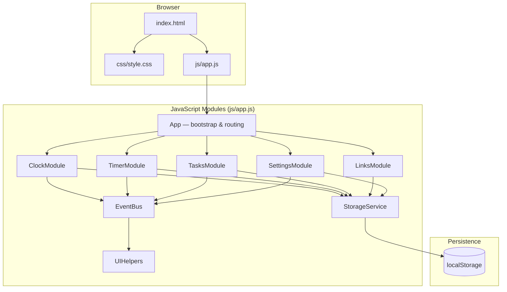
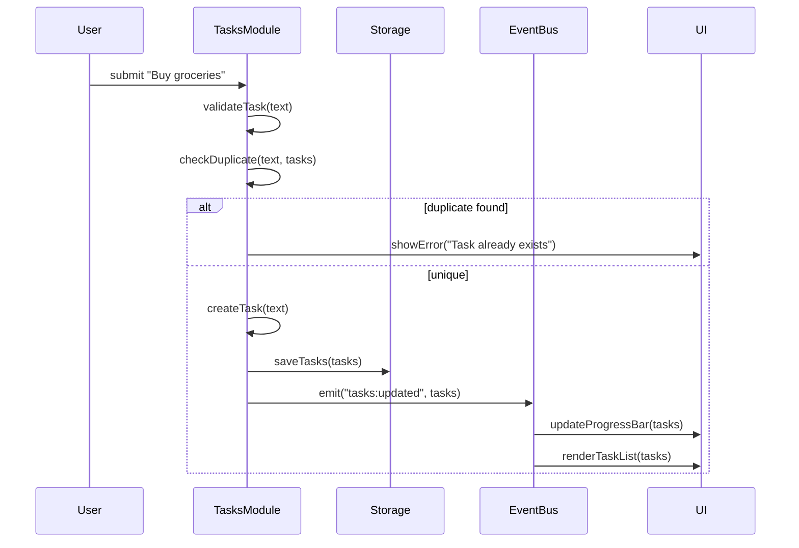
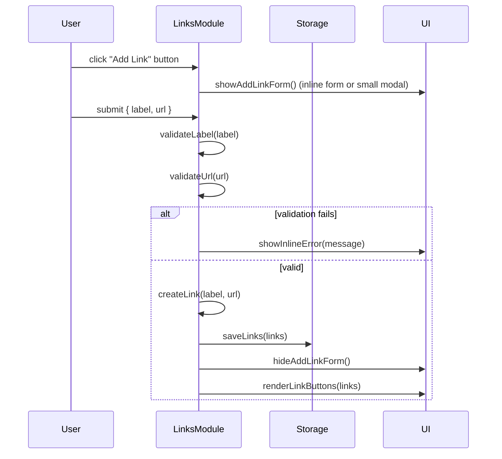
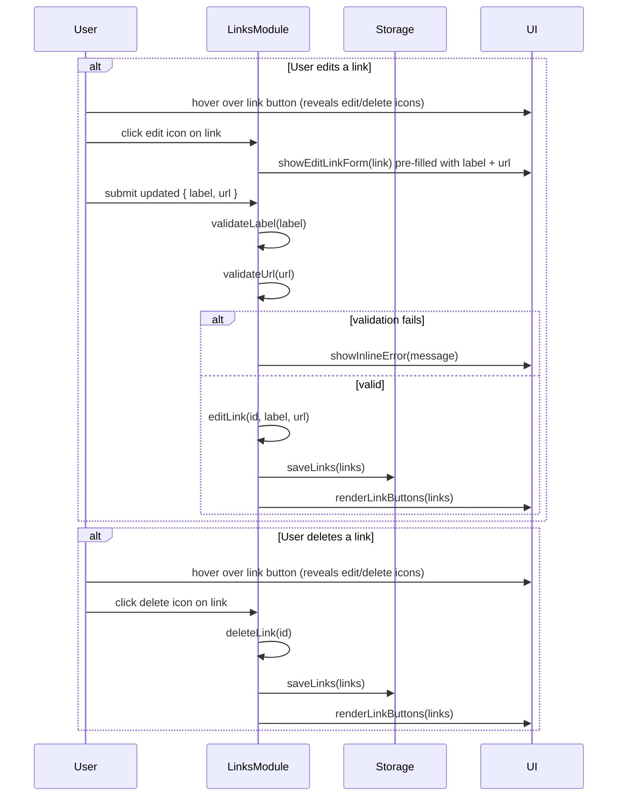
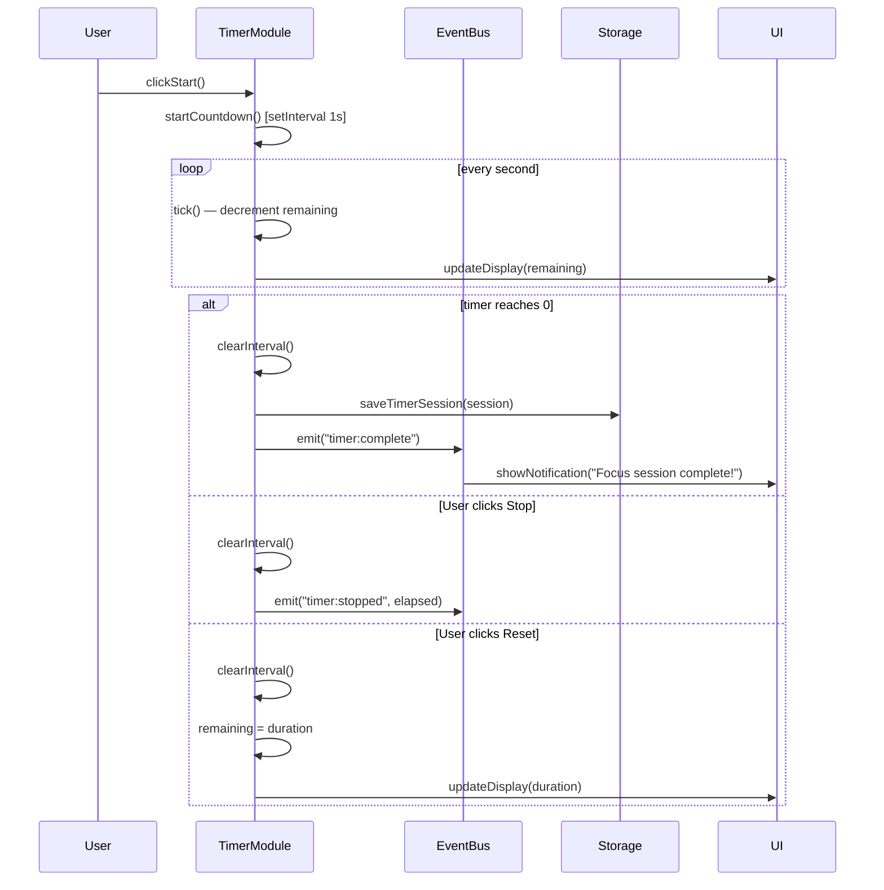

# Design Document: DailyBuddy Dashboard

## Overview

DailyBuddy is a lightweight, single-page web dashboard that helps users organize their day at a glance. It combines a live clock, a Pomodoro focus timer, a to-do list with progress tracking, and a quick-links panel — all persisted in browser Local Storage with no backend required.

The application is built with plain HTML, CSS, and vanilla JavaScript, making it trivially deployable as a standalone web page or browser new-tab homepage. All state is managed client-side; there are no network requests, no build steps, and no dependencies.

The design follows a modular JavaScript architecture where each feature area (Clock, Timer, Tasks, Links, Settings) is encapsulated in its own module that reads/writes through a shared `Storage` service. A lightweight event bus coordinates cross-module communication (e.g., the timer completing triggers a notification without the Timer module knowing about the UI).

---

## Architecture



---

## Sequence Diagrams

### Page Load & Initialization

```mermaid
sequenceDiagram
    participant Browser
    participant App
    participant Storage
    participant Clock
    participant Tasks
    participant Timer
    participant Links
    participant Settings

    Browser->>App: DOMContentLoaded
    App->>Storage: loadAll()
    Storage-->>App: { tasks, links, settings, timerHistory }
    App->>Settings: init(settings)
    Settings-->>App: applyTheme(theme), applyName(name)
    App->>Clock: init()
    Clock->>Clock: startTick() [setInterval 1s]
    App->>Tasks: init(tasks)
    Tasks-->>App: renderTaskList(), renderProgressBar()
    App->>Timer: init(timerSettings)
    Timer-->>App: renderTimerDisplay()
    App->>Links: init(links)
    Links-->>App: renderLinkButtons()
```

### Task Add Flow



### Edit Tasks Modal Flow

```mermaid
sequenceDiagram
    participant User
    participant TasksModule
    participant TaskModal
    participant Storage
    participant EventBus
    participant UI

    User->>TasksModule: click "Edit Tasks" button
    TasksModule->>TaskModal: openModal(tasks)
    TaskModal->>UI: renderBackdrop() + renderModalContent(tasks)

    alt User sorts tasks
        User->>TaskModal: select sort strategy (Default | A–Z | Done Last)
        TaskModal->>TaskModal: sortTasks(tasks, strategy)
        TaskModal->>UI: re-renderModalList(sorted)
    end

    alt User deletes a task
        User->>TaskModal: click delete button on task row
        TaskModal->>TasksModule: deleteTask(id)
        TasksModule->>Storage: saveTasks(tasks)
        TasksModule->>EventBus: emit("tasks:updated", tasks)
        TaskModal->>UI: re-renderModalList(tasks)
        EventBus->>UI: updateProgressBar(tasks)
    end

    alt User edits a task inline
        User->>TaskModal: click edit button on task row
        TaskModal->>UI: replaceLabel(id) with <input> pre-filled with task.text
        User->>TaskModal: modify text, click Save (or press Enter)
        TaskModal->>TaskModal: validateTask(newText)
        TaskModal->>TaskModal: checkDuplicate(newText, tasks, excludeId=id)
        alt invalid or duplicate
            TaskModal->>UI: showInlineError(id, message)
        else valid
            TaskModal->>TasksModule: editTask(id, newText)
            TasksModule->>Storage: saveTasks(tasks)
            TasksModule->>EventBus: emit("tasks:updated", tasks)
            TaskModal->>UI: restoreLabel(id, newText)
            EventBus->>UI: renderTaskList(tasks)
        end
    end

    alt User closes modal
        User->>TaskModal: click X button or backdrop
        TaskModal->>UI: removeBackdrop() + removeModal()
    end
```



### Quick Links — Add Link Flow



### Quick Links — Edit / Delete Flow



### Focus Timer Flow



---

## Components and Interfaces

### ClockModule

**Purpose**: Displays the live current time and date in the hero card. Updates every second via `setInterval`.

**Interface**:
```javascript
const ClockModule = {
  init(),                          // Start the 1-second tick interval
  destroy(),                       // Clear interval (cleanup)
  formatTime(date),                // Returns "HH:MM:SS" string
  formatDate(date),                // Returns "Wednesday, May 8th 2026"
  getGreeting(hour),               // Returns "Good Morning" | "Good Afternoon" | "Good Evening"
}
```

**Responsibilities**:
- Render current time and date into `#clock-time` and `#clock-date` DOM elements
- Derive time-of-day greeting string passed to SettingsModule for the welcome heading
- No state persistence needed (always reads from `new Date()`)

---

### TimerModule

**Purpose**: Implements a configurable countdown timer (default 25 minutes). Supports Start, Stop, and Reset actions.

**Interface**:
```javascript
const TimerModule = {
  init(settings),                  // Load saved duration, render initial display
  start(),                         // Begin countdown interval
  stop(),                          // Pause countdown, emit timer:stopped
  reset(),                         // Clear interval, restore to full duration
  setDuration(minutes),            // Update duration, save to Storage, reset display
  formatDisplay(totalSeconds),     // Returns "MM:SS" string
  getState(),                      // Returns { status, remaining, duration }
}
```

**Responsibilities**:
- Manage a single `setInterval` reference; never allow two concurrent intervals
- Emit `timer:complete` event when countdown reaches zero
- Persist custom duration to Storage so it survives page reload
- Disable Start button while running; disable Stop/Reset while idle

---

### TasksModule

**Purpose**: Full CRUD management for the to-do list with duplicate prevention, sorting, progress tracking, history view, and a modal overlay for bulk task management.

**Interface**:
```javascript
const TasksModule = {
  init(tasks),                     // Load tasks array, render list and progress bar
  addTask(text),                   // Validate, deduplicate, create, save, re-render
  editTask(id, newText),           // Update text, validate, save, re-render
  toggleTask(id),                  // Flip done boolean, save, update progress bar
  deleteTask(id),                  // Remove from array, save, re-render
  sortTasks(strategy),             // "default" | "az" | "done-last" — re-render in place
  getProgress(),                   // Returns { done: number, total: number, percent: number }
  getHistory(),                    // Returns tasks where done === true
  clearHistory(),                  // Remove completed tasks permanently
  openEditModal(),                 // Open the Edit Tasks modal overlay
  closeEditModal(),                // Close and remove the modal overlay
}
```

**Responsibilities**:
- Enforce uniqueness: case-insensitive trim comparison before adding or editing
- Maintain insertion order as default sort; other sorts are view-only (do not mutate saved order)
- Persist full tasks array to Storage on every mutation
- Emit `tasks:updated` event after each mutation so progress bar re-renders
- Render the Edit Tasks modal with a semi-transparent backdrop, sort controls, and per-row edit/delete actions
- Apply modal changes immediately (live updates to Storage and the main task list behind the modal)
- Trap focus within the modal while open; close on X button click or backdrop click

### TaskModal (sub-component of TasksModule)

**Purpose**: Overlay modal that provides sort, inline-edit, and delete controls for the full task list without leaving the main view.

**Interface**:
```javascript
const TaskModal = {
  open(tasks),                     // Render backdrop + modal, populate task rows
  close(),                         // Remove modal and backdrop from DOM
  renderRows(tasks),               // Re-render the task row list inside the modal
  activateEditRow(id),             // Replace task label with an <input> for inline editing
  deactivateEditRow(id, text),     // Restore label after save or cancel
  setSortStrategy(strategy),       // Update current sort, re-render rows
}
```

**Modal UI Elements**:
- Semi-transparent backdrop (`position: fixed`, covers full viewport)
- Modal card (centered, scrollable task list, pink/purple theme consistent with dashboard)
- Sort controls: three buttons or a `<select>` — Default, A–Z, Done Last
- Per-row controls: Edit button (pencil icon) and Delete button (trash icon)
- Inline edit state: label replaced by `<input>` with Save (✓) and Cancel (✗) buttons
- Close button (×) in the modal header; clicking backdrop also closes

---

### LinksModule

**Purpose**: Manages a collection of quick-link buttons that open URLs in a new tab. Supports adding, editing, and deleting links via an inline form or small modal, with edit/delete controls revealed on hover.

**Interface**:
```javascript
const LinksModule = {
  init(links),                     // Load links array, render buttons
  addLink(label, url),             // Validate label + URL, add, save, re-render
  editLink(id, label, url),        // Update, validate, save, re-render
  deleteLink(id),                  // Remove, save, re-render
  openLink(url),                   // window.open(url, "_blank", "noopener,noreferrer")
  showAddForm(),                   // Render the Add Link inline form / small modal
  hideAddForm(),                   // Remove the Add Link form from DOM
  showEditForm(id),                // Render the Edit Link form pre-filled for the given link
  hideEditForm(),                  // Remove the Edit Link form from DOM
}
```

**Responsibilities**:
- Validate URLs before saving (must be parseable by `new URL()` with `http:` or `https:` protocol)
- Validate labels: non-empty after trimming, max 50 characters
- Sanitize label text to prevent XSS (use `textContent`, never `innerHTML` for user input)
- Persist links array to Storage on every mutation
- Render each link as a styled button (label text, opens URL in new tab on click)
- Reveal edit (pencil) and delete (trash) icon buttons on hover or in an explicit edit mode
- Show Add Link button at the end of the links panel; clicking it opens the inline form
- Keep visual style consistent with the dashboard (pink/purple theme, card-based layout)

**Add/Edit Form Fields**:
- **Label**: text input, required, max 50 characters
- **URL**: text input, required, must be valid http/https URL
- **Save** button: validates both fields before persisting
- **Cancel** button: dismisses form without changes

---

### SettingsModule

**Purpose**: Manages user preferences: display name, color theme (light/dark), and timer duration.

**Interface**:
```javascript
const SettingsModule = {
  init(settings),                  // Apply saved theme and name on load
  setName(name),                   // Save name, update greeting heading
  getName(),                       // Returns saved name or "Friend" default
  toggleTheme(),                   // Flip light/dark, save, apply CSS class to <body>
  getTheme(),                      // Returns "light" | "dark"
  applyTheme(theme),               // Add/remove "dark-mode" class on document.body
}
```

**Responsibilities**:
- Apply theme by toggling a `dark-mode` CSS class on `<body>` (CSS handles all visual changes via custom properties)
- Default name is `"Friend"` when none is set
- Persist settings object to Storage on every change

---

### StorageService

**Purpose**: Thin wrapper around `localStorage` with JSON serialization, namespaced keys, and safe fallbacks.

**Interface**:
```javascript
const StorageService = {
  get(key, fallback),              // JSON.parse with try/catch; returns fallback on error
  set(key, value),                 // JSON.stringify and store
  remove(key),                     // localStorage.removeItem
  loadAll(),                       // Returns { tasks, links, settings, timerHistory }
  KEYS: {                          // Namespace constants
    TASKS:    "dailybuddy_tasks",
    LINKS:    "dailybuddy_links",
    SETTINGS: "dailybuddy_settings",
    TIMER:    "dailybuddy_timer",
  }
}
```

---

### EventBus

**Purpose**: Minimal publish/subscribe bus for decoupled cross-module communication.

**Interface**:
```javascript
const EventBus = {
  on(event, handler),              // Subscribe handler to event
  off(event, handler),             // Unsubscribe handler
  emit(event, payload),            // Call all handlers for event with payload
}
```

---

## Data Models

### Task

```javascript
/**
 * @typedef {Object} Task
 * @property {string}  id        - Unique ID: crypto.randomUUID() or Date.now().toString()
 * @property {string}  text      - Task description (trimmed, non-empty)
 * @property {boolean} done      - Completion status
 * @property {number}  createdAt - Unix timestamp (ms)
 * @property {number|null} completedAt - Unix timestamp when marked done, else null
 */
```

**Validation Rules**:
- `text` must be non-empty after trimming
- `text` must be unique (case-insensitive) within the current task list
- `text` max length: 200 characters

### QuickLink

```javascript
/**
 * @typedef {Object} QuickLink
 * @property {string} id    - Unique ID
 * @property {string} label - Display name for the button
 * @property {string} url   - Full URL (must pass `new URL(url)` validation)
 */
```

**Validation Rules**:
- `url` must be parseable by `new URL(url)` — rejects relative paths and malformed strings
- `label` must be non-empty after trimming; max 50 characters
- `url` protocol must be `http:` or `https:` only

### Settings

```javascript
/**
 * @typedef {Object} Settings
 * @property {string} name          - User's display name (default: "Friend")
 * @property {"light"|"dark"} theme - Color theme (default: "light")
 * @property {number} timerDuration - Pomodoro duration in minutes (default: 25)
 */
```

### TimerSession (History)

```javascript
/**
 * @typedef {Object} TimerSession
 * @property {string} id          - Unique ID
 * @property {number} duration    - Configured duration in seconds
 * @property {number} elapsed     - Actual seconds elapsed before stop/complete
 * @property {boolean} completed  - Whether the full duration was reached
 * @property {number} startedAt   - Unix timestamp
 */
```

---

## Algorithmic Pseudocode

### Task Addition Algorithm

```pascal
PROCEDURE addTask(text)
  INPUT: text (string from user input)
  OUTPUT: void (mutates tasks array, persists, re-renders)

  SEQUENCE
    trimmed ← text.trim()

    IF trimmed = "" THEN
      CALL showError("Task cannot be empty")
      RETURN
    END IF

    IF trimmed.length > 200 THEN
      CALL showError("Task is too long (max 200 characters)")
      RETURN
    END IF

    normalised ← trimmed.toLowerCase()

    FOR each task IN tasks DO
      IF task.text.toLowerCase() = normalised THEN
        CALL showError("Task already exists")
        RETURN
      END IF
    END FOR

    newTask ← {
      id:          generateId(),
      text:        trimmed,
      done:        false,
      createdAt:   Date.now(),
      completedAt: null
    }

    tasks.push(newTask)
    CALL StorageService.set(KEYS.TASKS, tasks)
    CALL EventBus.emit("tasks:updated", tasks)
    CALL renderTaskList(tasks)
    CALL renderProgressBar(getProgress(tasks))
  END SEQUENCE
END PROCEDURE
```

**Preconditions**:
- `tasks` is a valid array (may be empty)
- `text` is a string (may be empty or whitespace)

**Postconditions**:
- If valid and unique: `tasks` contains one new Task; Storage is updated; UI reflects new state
- If invalid or duplicate: `tasks` is unchanged; an error message is shown to the user

**Loop Invariants**:
- All tasks examined before the current index have `text.toLowerCase() ≠ normalised`

---

### Progress Calculation Algorithm

```pascal
FUNCTION getProgress(tasks)
  INPUT: tasks (array of Task)
  OUTPUT: { done, total, percent }

  SEQUENCE
    total ← tasks.length
    done  ← 0

    FOR each task IN tasks DO
      IF task.done = true THEN
        done ← done + 1
      END IF
    END FOR

    IF total = 0 THEN
      percent ← 0
    ELSE
      percent ← Math.round((done / total) * 100)
    END IF

    RETURN { done, total, percent }
  END SEQUENCE
END FUNCTION
```

**Preconditions**:
- `tasks` is a valid array (may be empty)

**Postconditions**:
- `percent` is an integer in the range [0, 100]
- `done ≤ total`
- If `total = 0`, `percent = 0` (no division by zero)

**Loop Invariants**:
- `done` equals the count of completed tasks examined so far

---

### Timer Countdown Algorithm

```pascal
PROCEDURE startCountdown()
  INPUT: none (reads module state: remaining, duration)
  OUTPUT: void (mutates remaining, updates display)

  PRECONDITION: status = "idle" AND remaining > 0

  SEQUENCE
    IF intervalId ≠ null THEN
      RETURN  // Guard: prevent double-start
    END IF

    status    ← "running"
    startedAt ← Date.now()

    intervalId ← setInterval(PROCEDURE tick()
      SEQUENCE
        remaining ← remaining - 1
        CALL updateDisplay(remaining)

        IF remaining ≤ 0 THEN
          CALL clearInterval(intervalId)
          intervalId ← null
          status     ← "idle"
          CALL StorageService.set(KEYS.TIMER, buildSession(duration, duration, true))
          CALL EventBus.emit("timer:complete")
        END IF
      END SEQUENCE
    , 1000)
  END SEQUENCE
END PROCEDURE
```

**Preconditions**:
- `status = "idle"` (not already running)
- `remaining > 0`
- No existing `intervalId` is active

**Postconditions**:
- `status = "running"` while countdown is active
- `status = "idle"` after completion or stop
- `intervalId` is `null` after the interval is cleared
- `timer:complete` is emitted exactly once when `remaining` reaches 0

**Loop Invariants** (per tick):
- `remaining` decreases by exactly 1 each tick
- `remaining ≥ 0` at all times (clamped before display)

---

### URL Validation Algorithm

```pascal
FUNCTION validateUrl(url)
  INPUT: url (string)
  OUTPUT: { valid: boolean, error: string | null }

  SEQUENCE
    trimmed ← url.trim()

    IF trimmed = "" THEN
      RETURN { valid: false, error: "URL cannot be empty" }
    END IF

    TRY
      parsed ← new URL(trimmed)

      IF parsed.protocol ≠ "http:" AND parsed.protocol ≠ "https:" THEN
        RETURN { valid: false, error: "URL must start with http:// or https://" }
      END IF

      RETURN { valid: true, error: null }
    CATCH
      RETURN { valid: false, error: "Invalid URL format" }
    END TRY
  END SEQUENCE
END FUNCTION
```

**Preconditions**:
- `url` is a string (may be empty)

**Postconditions**:
- Returns `{ valid: true, error: null }` if and only if URL is well-formed with http/https protocol
- Returns `{ valid: false, error: <message> }` for all invalid inputs
- Never throws; all errors are caught and returned as structured values

---

### Sort Tasks Algorithm

```pascal
FUNCTION sortTasks(tasks, strategy)
  INPUT: tasks (array of Task), strategy ("default" | "az" | "done-last")
  OUTPUT: sorted (new array, original tasks array is NOT mutated)

  SEQUENCE
    sorted ← tasks.slice()  // shallow copy

    IF strategy = "az" THEN
      sorted.sort(COMPARATOR (a, b) =>
        a.text.toLowerCase().localeCompare(b.text.toLowerCase())
      )
    ELSE IF strategy = "done-last" THEN
      sorted.sort(COMPARATOR (a, b) =>
        IF a.done = b.done THEN RETURN 0
        IF a.done = true   THEN RETURN 1
        RETURN -1
      )
    ELSE  // "default" — preserve insertion order (createdAt ascending)
      sorted.sort(COMPARATOR (a, b) => a.createdAt - b.createdAt)
    END IF

    RETURN sorted
  END SEQUENCE
END FUNCTION
```

**Preconditions**:
- `tasks` is a valid array
- `strategy` is one of the three defined values

**Postconditions**:
- Returns a new array; the original `tasks` array is unchanged
- All tasks from the input are present in the output (no items added or removed)
- Sort is stable for equal elements (relies on `Array.prototype.sort` stability, guaranteed in ES2019+)

---

### Edit Tasks Modal Algorithm

```pascal
PROCEDURE openEditModal()
  INPUT: none (reads module state: tasks)
  OUTPUT: void (renders modal overlay in DOM)

  SEQUENCE
    // Render backdrop
    backdrop ← createElement("div", class="modal-backdrop")
    backdrop.addEventListener("click", closeEditModal)
    document.body.appendChild(backdrop)

    // Render modal card
    modal ← createElement("div", class="edit-tasks-modal")
    modal.innerHTML ← buildModalShell()  // header with X button + sort controls + task list container

    // Populate task rows
    currentSort ← "default"
    CALL renderModalRows(sortTasks(tasks, currentSort))

    // Wire sort controls
    FOR each sortButton IN modal.querySelectorAll(".sort-btn") DO
      sortButton.addEventListener("click", PROCEDURE()
        currentSort ← sortButton.dataset.strategy
        CALL renderModalRows(sortTasks(tasks, currentSort))
      END PROCEDURE)
    END FOR

    // Wire close button
    modal.querySelector(".modal-close").addEventListener("click", closeEditModal)

    document.body.appendChild(modal)
    modal.querySelector(".modal-close").focus()  // Accessibility: move focus into modal
  END SEQUENCE
END PROCEDURE

PROCEDURE renderModalRows(sortedTasks)
  INPUT: sortedTasks (array of Task, sorted for display)
  OUTPUT: void (re-renders the task list inside the modal)

  SEQUENCE
    container ← modal.querySelector(".modal-task-list")
    container.innerHTML ← ""

    FOR each task IN sortedTasks DO
      row ← buildTaskRow(task)  // label + edit button + delete button
      container.appendChild(row)
    END FOR
  END SEQUENCE
END PROCEDURE

PROCEDURE handleModalEdit(id)
  INPUT: id (string — task ID to edit inline)
  OUTPUT: void (replaces label with input field)

  SEQUENCE
    task ← tasks.find(t => t.id = id)
    row  ← modal.querySelector("[data-id='" + id + "']")

    // Replace label with input
    input ← createElement("input", type="text", value=task.text)
    saveBtn  ← createElement("button", text="✓")
    cancelBtn ← createElement("button", text="✗")

    saveBtn.addEventListener("click", PROCEDURE()
      newText ← input.value.trim()

      IF newText = "" THEN
        CALL showInlineError(row, "Task cannot be empty")
        RETURN
      END IF

      IF newText.length > 200 THEN
        CALL showInlineError(row, "Task is too long (max 200 characters)")
        RETURN
      END IF

      normalised ← newText.toLowerCase()
      FOR each t IN tasks DO
        IF t.id ≠ id AND t.text.toLowerCase() = normalised THEN
          CALL showInlineError(row, "Task already exists")
          RETURN
        END IF
      END FOR

      CALL TasksModule.editTask(id, newText)
      CALL renderModalRows(sortTasks(tasks, currentSort))
    END PROCEDURE)

    cancelBtn.addEventListener("click", PROCEDURE()
      CALL renderModalRows(sortTasks(tasks, currentSort))
    END PROCEDURE)

    row.replaceChildren(input, saveBtn, cancelBtn)
    input.focus()
    input.select()
  END SEQUENCE
END PROCEDURE

PROCEDURE closeEditModal()
  INPUT: none
  OUTPUT: void (removes modal and backdrop from DOM)

  SEQUENCE
    modal    ← document.querySelector(".edit-tasks-modal")
    backdrop ← document.querySelector(".modal-backdrop")

    IF modal ≠ null    THEN modal.remove()    END IF
    IF backdrop ≠ null THEN backdrop.remove() END IF
  END SEQUENCE
END PROCEDURE
```

**Preconditions** (openEditModal):
- `tasks` is a valid array (may be empty)
- No modal is currently open (guard: check for existing `.edit-tasks-modal` before creating)

**Postconditions** (openEditModal):
- A backdrop and modal card are present in the DOM
- All task rows are rendered with edit and delete controls
- Sort controls reflect `currentSort = "default"`
- Focus is moved to the close button (accessibility)

**Postconditions** (closeEditModal):
- No `.edit-tasks-modal` or `.modal-backdrop` elements remain in the DOM
- Main task list behind the modal reflects the latest saved state

---

### Add Quick Link Algorithm

```pascal
PROCEDURE addLink(label, url)
  INPUT: label (string), url (string)
  OUTPUT: { success: boolean, error: string | null }

  SEQUENCE
    trimmedLabel ← label.trim()
    trimmedUrl   ← url.trim()

    // Validate label
    IF trimmedLabel = "" THEN
      RETURN { success: false, error: "Label cannot be empty" }
    END IF

    IF trimmedLabel.length > 50 THEN
      RETURN { success: false, error: "Label must be 50 characters or fewer" }
    END IF

    // Validate URL
    urlResult ← validateUrl(trimmedUrl)
    IF urlResult.valid = false THEN
      RETURN { success: false, error: urlResult.error }
    END IF

    newLink ← {
      id:    generateId(),
      label: trimmedLabel,
      url:   trimmedUrl
    }

    links.push(newLink)
    CALL StorageService.set(KEYS.LINKS, links)
    CALL renderLinkButtons(links)
    CALL hideAddForm()

    RETURN { success: true, error: null }
  END SEQUENCE
END PROCEDURE
```

**Preconditions**:
- `links` is a valid array (may be empty)
- `label` and `url` are strings (may be empty or whitespace)

**Postconditions**:
- If valid: `links` contains one new QuickLink; Storage is updated; link buttons re-render; form is dismissed
- If invalid: `links` is unchanged; an inline error message is shown; form remains open

---

### Edit Quick Link Algorithm

```pascal
PROCEDURE editLink(id, label, url)
  INPUT: id (string), label (string), url (string)
  OUTPUT: { success: boolean, error: string | null }

  SEQUENCE
    trimmedLabel ← label.trim()
    trimmedUrl   ← url.trim()

    // Validate label
    IF trimmedLabel = "" THEN
      RETURN { success: false, error: "Label cannot be empty" }
    END IF

    IF trimmedLabel.length > 50 THEN
      RETURN { success: false, error: "Label must be 50 characters or fewer" }
    END IF

    // Validate URL
    urlResult ← validateUrl(trimmedUrl)
    IF urlResult.valid = false THEN
      RETURN { success: false, error: urlResult.error }
    END IF

    index ← links.findIndex(l => l.id = id)
    IF index = -1 THEN
      RETURN { success: false, error: "Link not found" }
    END IF

    links[index].label ← trimmedLabel
    links[index].url   ← trimmedUrl

    CALL StorageService.set(KEYS.LINKS, links)
    CALL renderLinkButtons(links)
    CALL hideEditForm()

    RETURN { success: true, error: null }
  END SEQUENCE
END PROCEDURE
```

**Preconditions**:
- `id` corresponds to an existing link in `links`
- `label` and `url` are strings

**Postconditions**:
- If valid: the matching link is updated in place; Storage is updated; link buttons re-render; edit form is dismissed
- If invalid: `links` is unchanged; an inline error is shown; edit form remains open

---

## Key Functions with Formal Specifications

### `generateId()`

```javascript
function generateId() // Returns string
```

**Preconditions**: None

**Postconditions**:
- Returns a non-empty string
- With overwhelming probability, the returned value is unique across all prior calls in the session
- Uses `crypto.randomUUID()` when available, falls back to `Date.now() + Math.random()`

---

### `renderTaskList(tasks)`

```javascript
function renderTaskList(tasks) // Returns void
```

**Preconditions**:
- `tasks` is a valid array of Task objects
- `#task-list` DOM element exists

**Postconditions**:
- `#task-list` innerHTML is fully replaced with current task state
- Each task renders a checkbox, label, edit button, and delete button
- Checked state matches `task.done`
- No stale DOM nodes remain from previous render

---

### `applyTheme(theme)`

```javascript
function applyTheme(theme) // Returns void
```

**Preconditions**:
- `theme` is `"light"` or `"dark"`
- `document.body` exists

**Postconditions**:
- If `theme = "dark"`: `document.body.classList` contains `"dark-mode"`
- If `theme = "light"`: `document.body.classList` does NOT contain `"dark-mode"`
- Toggle button label reflects current theme
- No other classes are added or removed from `document.body`

---

### `formatTime(date)`

```javascript
function formatTime(date) // Returns string "HH:MM:SS"
```

**Preconditions**:
- `date` is a valid `Date` object

**Postconditions**:
- Returns a string matching the pattern `\d{2}:\d{2}:\d{2}`
- Hours, minutes, and seconds are zero-padded to 2 digits
- Reflects the local time of the provided `date`

---

### `openEditModal()`

```javascript
function openEditModal() // Returns void
```

**Preconditions**:
- `tasks` is a valid array
- No `.edit-tasks-modal` element currently exists in the DOM

**Postconditions**:
- A `.modal-backdrop` and `.edit-tasks-modal` are appended to `document.body`
- All tasks are rendered as rows with edit and delete controls
- Sort controls default to "Default" (insertion order)
- Focus is moved to the modal close button

---

### `closeEditModal()`

```javascript
function closeEditModal() // Returns void
```

**Preconditions**: None (safe to call even if no modal is open)

**Postconditions**:
- No `.edit-tasks-modal` or `.modal-backdrop` elements remain in the DOM
- Main task list reflects the latest persisted state

---

### `LinksModule.addLink(label, url)`

```javascript
function addLink(label, url) // Returns { success: boolean, error: string | null }
```

**Preconditions**:
- `label` and `url` are strings

**Postconditions**:
- If valid: new QuickLink appended to `links`; Storage updated; buttons re-rendered; form dismissed
- If invalid: `links` unchanged; error message shown inline; form remains open
- Never throws; all validation errors are returned as structured values

---

### `LinksModule.editLink(id, label, url)`

```javascript
function editLink(id, label, url) // Returns { success: boolean, error: string | null }
```

**Preconditions**:
- `id` is a string (may not correspond to an existing link)
- `label` and `url` are strings

**Postconditions**:
- If valid and found: matching link updated in place; Storage updated; buttons re-rendered
- If invalid or not found: `links` unchanged; error returned
- Never throws

---

## Example Usage

```javascript
// ── Bootstrap ──────────────────────────────────────────────────────────────
document.addEventListener("DOMContentLoaded", () => {
  const data = StorageService.loadAll();

  SettingsModule.init(data.settings);
  ClockModule.init();
  TasksModule.init(data.tasks);
  TimerModule.init(data.settings);
  LinksModule.init(data.links);
});

// ── Adding a task ───────────────────────────────────────────────────────────
document.querySelector("#add-task-form").addEventListener("submit", (e) => {
  e.preventDefault();
  const input = document.querySelector("#task-input");
  TasksModule.addTask(input.value);
  input.value = "";
});

// ── Toggling theme ──────────────────────────────────────────────────────────
document.querySelector("#theme-toggle").addEventListener("click", () => {
  SettingsModule.toggleTheme();
});

// ── Setting user name ───────────────────────────────────────────────────────
document.querySelector("#set-name-btn").addEventListener("click", () => {
  const name = prompt("Enter your name:");
  if (name !== null) SettingsModule.setName(name);
});

// ── Timer controls ──────────────────────────────────────────────────────────
document.querySelector("#timer-start").addEventListener("click", () => TimerModule.start());
document.querySelector("#timer-stop").addEventListener("click",  () => TimerModule.stop());
document.querySelector("#timer-reset").addEventListener("click", () => TimerModule.reset());

// ── Adding a quick link ─────────────────────────────────────────────────────
function handleAddLink() {
  const label = document.querySelector("#link-label").value;
  const url   = document.querySelector("#link-url").value;
  LinksModule.addLink(label, url);
}

// ── Opening the Edit Tasks modal ────────────────────────────────────────────
document.querySelector("#edit-tasks-btn").addEventListener("click", () => {
  TasksModule.openEditModal();
});

// ── Quick Links: show add form ──────────────────────────────────────────────
document.querySelector("#add-link-btn").addEventListener("click", () => {
  LinksModule.showAddForm();
});

// ── Quick Links: submit add form ────────────────────────────────────────────
document.querySelector("#link-add-form").addEventListener("submit", (e) => {
  e.preventDefault();
  const label = document.querySelector("#link-label-input").value;
  const url   = document.querySelector("#link-url-input").value;
  const result = LinksModule.addLink(label, url);
  if (!result.success) {
    document.querySelector("#link-form-error").textContent = result.error;
  }
});

// ── Listening to cross-module events ───────────────────────────────────────
EventBus.on("timer:complete", () => {
  // Browser notification (if permission granted)
  if (Notification.permission === "granted") {
    new Notification("DailyBuddy", { body: "Focus session complete! Take a break." });
  }
});

EventBus.on("tasks:updated", (tasks) => {
  const progress = TasksModule.getProgress();
  document.querySelector("#progress-bar").style.width = `${progress.percent}%`;
  document.querySelector("#progress-label").textContent = `${progress.percent}%`;
});
```

---

## Correctness Properties

1. **Task uniqueness**: For all tasks `t1`, `t2` in the tasks array where `t1.id ≠ t2.id`, `t1.text.toLowerCase().trim() ≠ t2.text.toLowerCase().trim()`

2. **Progress bounds**: For any tasks array, `getProgress().percent` is always an integer in `[0, 100]`

3. **Progress accuracy**: `getProgress().done` equals the exact count of tasks where `done === true`

4. **Timer non-negative**: `TimerModule.getState().remaining` is always `≥ 0`

5. **Timer single interval**: At most one `setInterval` is active for the timer at any point in time

6. **Storage round-trip**: For any serializable value `v`, `StorageService.get(key, null)` returns a deep-equal value after `StorageService.set(key, v)`

7. **URL safety**: All URLs stored in `links` pass `new URL(url)` without throwing and have protocol `http:` or `https:`

8. **Sort non-destructive**: `sortTasks(tasks, strategy).length === tasks.length` for all valid strategies

9. **Theme idempotency**: Calling `applyTheme(theme)` twice with the same argument produces the same DOM state as calling it once

10. **XSS prevention**: No user-supplied string is ever assigned to `innerHTML`; all user content is set via `textContent` or `setAttribute`

---

## Error Handling

### Scenario 1: localStorage Unavailable

**Condition**: `localStorage` throws (private browsing mode, storage quota exceeded, or browser restriction)

**Response**: `StorageService.get()` catches the exception and returns the provided fallback value; `StorageService.set()` catches and silently no-ops

**Recovery**: App continues to function in-memory for the session; data is lost on page close; a subtle banner warns the user that persistence is unavailable

---

### Scenario 2: Duplicate Task Submission

**Condition**: User submits a task whose text (case-insensitive, trimmed) matches an existing task

**Response**: `addTask()` returns early without mutating state; an inline error message appears near the input field

**Recovery**: Input field retains the user's text so they can modify it; error clears on next keystroke

---

### Scenario 3: Invalid URL for Quick Link

**Condition**: User submits a URL that fails `new URL()` parsing or uses a non-http/https protocol

**Response**: `LinksModule.addLink()` returns `{ valid: false, error: <message> }`; error is shown inline

**Recovery**: Input field retains the user's text; no link is added to storage

---

### Scenario 4: Timer Double-Start

**Condition**: `TimerModule.start()` is called while the timer is already running (e.g., rapid button clicks)

**Response**: Guard clause checks `intervalId !== null`; second call returns immediately without creating a second interval

**Recovery**: No duplicate intervals; UI Start button is disabled while `status === "running"`

---

### Scenario 5: Corrupted localStorage Data

**Condition**: `JSON.parse()` throws on stored data (manually edited or corrupted)

**Response**: `StorageService.get()` catches the parse error and returns the fallback value (empty array or default object)

**Recovery**: App initializes with clean default state; corrupted key is overwritten on next save

---

## Testing Strategy

### Unit Testing Approach

Each module exposes pure functions that can be tested in isolation. Key unit test targets:

- `getProgress([])` → `{ done: 0, total: 0, percent: 0 }`
- `getProgress([{done:true}, {done:false}])` → `{ done: 1, total: 2, percent: 50 }`
- `validateUrl("not-a-url")` → `{ valid: false }`
- `validateUrl("https://google.com")` → `{ valid: true }`
- `validateUrl("javascript:alert(1)")` → `{ valid: false }`
- `sortTasks(tasks, "az")` does not mutate original array
- `formatTime(new Date("2026-05-08T10:45:22"))` → `"10:45:22"`
- `getGreeting(9)` → `"Good Morning"`
- `getGreeting(14)` → `"Good Afternoon"`
- `getGreeting(20)` → `"Good Evening"`

### Property-Based Testing Approach

**Property Test Library**: fast-check (if testing is added in future)

Key properties to verify:
- `getProgress(tasks).percent` is always in `[0, 100]` for any array of tasks
- `sortTasks(tasks, strategy)` always returns an array of the same length as input
- `addTask` followed by `getProgress` always increases `done` count by 0 or 1
- `StorageService.get(key, fb)` after `StorageService.set(key, v)` returns deep-equal `v`

### Integration Testing Approach

Manual browser testing checklist (no test framework required per NFR-1):

- [ ] Page loads without console errors in Chrome, Firefox, Edge, Safari
- [ ] Clock updates every second
- [ ] Tasks persist across page reload
- [ ] Dark mode persists across page reload
- [ ] Timer completes and resets correctly
- [ ] Duplicate task is rejected with error message
- [ ] Quick link opens in new tab
- [ ] Invalid URL is rejected with error message

---

## Performance Considerations

- **Clock interval**: A single `setInterval` at 1000ms is negligible CPU cost; no `requestAnimationFrame` needed for a seconds-precision clock
- **DOM rendering**: Task list re-renders the full list on each mutation (acceptable for typical to-do list sizes of < 100 items); if lists grow large, a keyed diff approach can be added
- **localStorage**: Synchronous reads/writes are fast for the small payloads involved (< 10 KB total); no async storage API is needed
- **No external resources**: Zero network requests after initial page load; no CDN fonts or icon libraries that could block rendering
- **CSS transitions**: Theme toggle and progress bar use CSS transitions (`transition: 0.3s ease`) for smooth visual feedback without JavaScript animation loops

---

## Security Considerations

- **XSS prevention**: All user-supplied content (task text, link labels, user name) is inserted via `element.textContent` or `element.setAttribute("href", sanitizedUrl)`, never via `innerHTML`
- **URL protocol enforcement**: Only `http:` and `https:` protocols are accepted for quick links; `javascript:`, `data:`, and `file:` URLs are rejected
- **`noopener` on links**: All `window.open()` calls include `"noopener,noreferrer"` to prevent the opened page from accessing `window.opener`
- **No eval / no dynamic code**: No use of `eval()`, `Function()`, or `setTimeout(string)` anywhere in the codebase
- **Content Security Policy**: The HTML file should include a `<meta http-equiv="Content-Security-Policy">` tag restricting scripts to `'self'` and disabling `unsafe-inline` for scripts

---

## File Structure

```
dailybuddy/
├── index.html          # Single HTML file — all markup and DOM structure
├── css/
│   └── style.css       # Single CSS file — all styles, themes, responsive layout
└── js/
    └── app.js          # Single JS file — all modules, event handlers, initialization
```

---

## Dependencies

None. The application uses only:
- Native browser APIs: `localStorage`, `setInterval`, `clearInterval`, `Date`, `crypto.randomUUID`, `Notification`, `window.open`
- No npm packages, no CDN scripts, no build tools, no transpilation required
